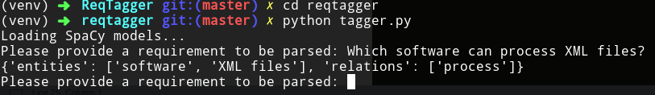

# ReqTagger
ReqTagger - A rule-based tagger for automatic Glossary of Termsextraction from ontology requirements

## The tool

### Requirements

In order to run `ReqTagger` SpaCy has to be installed using `pip install spacy` command in your commandline (please ensure that you have at least `Python` in version 3.6 and `pip` tool installed before running that command).

### ReqTagger running
`ReqTagger` can be run using the following commands:

`cd reqtagger` -- move to the folder with the implementation
`python3 tagger.py` -- run the script which extracts entities and relations in the loop

### ReqTagger source
The implementation of `Reqtagger` can be found in [reqtagger/reqtagger.py](reqtagger/reqtagger.py)

The entry point, which can be used to use this class can be found in [reqtagger/tagger.py](reqtagger/tagger.py) (please see ReqTagger running section).

## Evaluation procedures

## Evaluation set
Our evaluation sets with gold standard tags provided are located in the following files:

[evaluation_cqs.json](evaluation_cqs.json) -- containing CQs used to evaluate ReqTagger

[evaluation_statements.json](evaluation_statements.json) -- containing statements used to evaluate ReqTagger

All requirements are coming from [CORAL dataset](https://coralcorpus.linkeddata.es/)