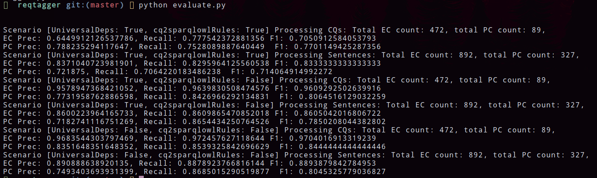
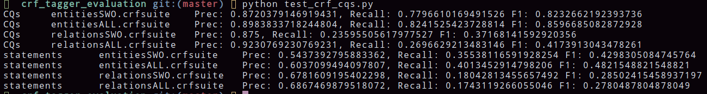

# ReqTagger
ReqTagger - A rule-based tagger for automatic Glossary of Termsextraction from ontology requirements

## The tool

### Requirements

In order to run `ReqTagger` SpaCy has to be installed using `pip install spacy` command in your commandline (please ensure that you have at least `Python` in version 3.6 and `pip` tool installed before running that command).

### ReqTagger running
`ReqTagger` can be run using the following commands:

`cd reqtagger` -- move to the folder with the implementation
Install all dependencies with `pip install -r requirements.txt`
`python3 tagger.py` -- run the script which extracts entities and relations in the loop

### ReqTagger source
The implementation of `Reqtagger` can be found in [reqtagger/reqtagger.py](reqtagger/reqtagger.py)

The entry point, which can be used to use this class can be found in [reqtagger/tagger.py](reqtagger/tagger.py) (please see ReqTagger running section).

## Evaluation procedures

The method can be evaluated on the evaluation set and compared to alternative implementations. The evaluators are implemented in [reqtagger/evaluate.py](reqtagger/evaluate.py) (a script for `ReqTagger` fueled with rules coming from `CQ2SPARQLOWL` dataset, and `ReqTagger` own rules expressed with Universal and OntoNotes POS-tags) and [crf_tagger_evaluation/test_crf_cqs.py](crf_tagger_evaluation/test_crf_cqs.py) (a script with the evaluation of an alternative appraoch called [CRF-based tagger](https://github.com/dwisniewski/CRFBasedGlossaryOfTermsExtraction) )

Please run `cd reqtagger` `pip install -r requirements.txt` and `python3 evaluate.py` in order to evaluate ReqTagger using various scenarios. The scenarios are:
- Use rules from [CQ2SPARQLOWL](https://github.com/CQ2SPARQLOWL/Dataset) dataset and noun chunking in `ReqTagger` to extract information from Competency Questions.
- Use rules from [CQ2SPARQLOWL](https://github.com/CQ2SPARQLOWL/Dataset) dataset and noun chunking in `ReqTagger` to extract information from statements.
- Use `ReqTagger` using Universal Dependencies to extract information from Competency Questions.
- Use `ReqTagger` using Universal Dependencies to extract information from statements.
- Use `ReqTagger` using OntoNotes 5 version of the Penn Treebank POS-tags to extract information from Competency Questions.
- Use `ReqTagger` using OntoNotes 5 version of the Penn Treebank POS-tags to extract information from statements.

For each evaluation scenario precision, recall and F1 scores are measured and printed.

For comparison purposes we added an evaluator measuring the quality of [CRF-based tagger](https://github.com/dwisniewski/CRFBasedGlossaryOfTermsExtraction) being an automatic tagger trained using Conditional Random Fields.

In order to train models and evaluate on our evaluation set, one has to:

Move to a folder with `CRF tagger` with `cd crf_tagger_evaluation`

Install all dependencies with `pip install -r requirements.txt`

Run `python3 test_crf_cqs.py`. 

The script trains various models:
- model tagging entities trained on [SWO materialized Competency Questions](crf_tagger_evaluation/data/train.conll).
- model tagging entities trained on [all CQ2SPARQLOWL dataset](crf_tagger_evaluation/data/merged.conll).
- model tagging relations trained on [SWO materialized Competency Questions](crf_tagger_evaluation/data/train.conll).
- model tagging relations trained on [all CQ2SPARQLOWL dataset](crf_tagger_evaluation/data/merged.conll).

For each evaluation scenario precision, recall and F1 scores are measured and printed.

## Evaluation set
Our evaluation sets with gold standard tags provided are located in the following files:

[evaluation_cqs.json](evaluation_cqs.json) -- containing CQs used to evaluate ReqTagger

[evaluation_statements.json](evaluation_statements.json) -- containing statements used to evaluate ReqTagger

All requirements are coming from [CORAL dataset](https://coralcorpus.linkeddata.es/)